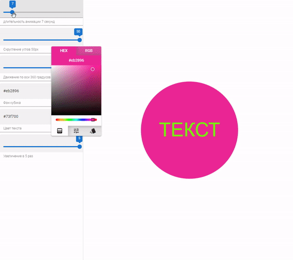

# VUE+PINIA+QUASAR+GSAP
Небольшой визуальный редактор для кастомизации анимированного блока. Построен на vue, библиотеке управления состоянием pinia, фреймворке quasar и библиотеке для анимации GSAP.  
ПОСМОТРЕТЬ САЙТ МОЖНО [ТУТ](https://project-2.newexp.xyz/)  



# Инструкция для Quasar

## Install the dependencies
```bash
yarn
# or
npm install
```

### Start the app in development mode (hot-code reloading, error reporting, etc.)
```bash
quasar dev
```


### Lint the files
```bash
yarn lint
# or
npm run lint
```


### Format the files
```bash
yarn format
# or
npm run format
```


### Build the app for production
```bash
quasar build
```

### Customize the configuration
See [Configuring quasar.config.js](https://v2.quasar.dev/quasar-cli-vite/quasar-config-js).
